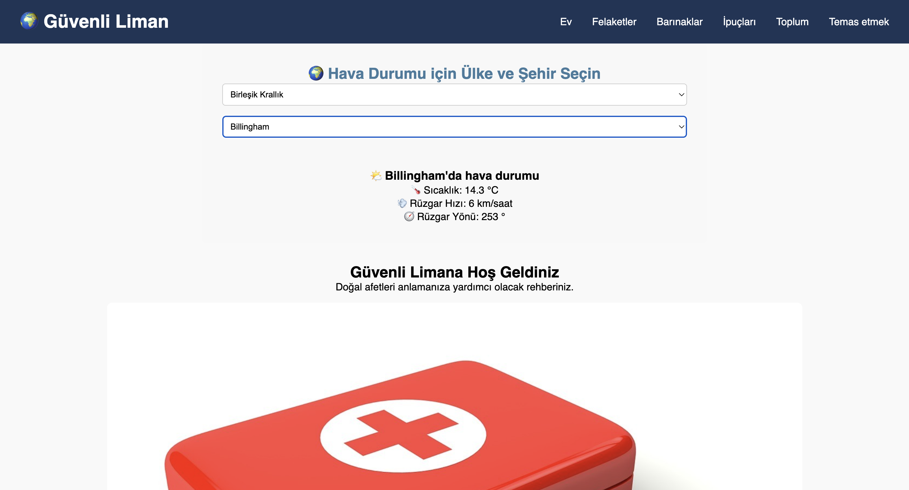
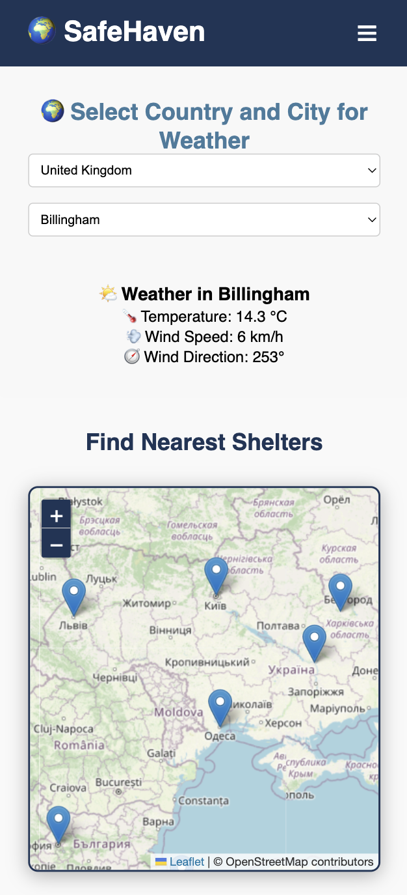
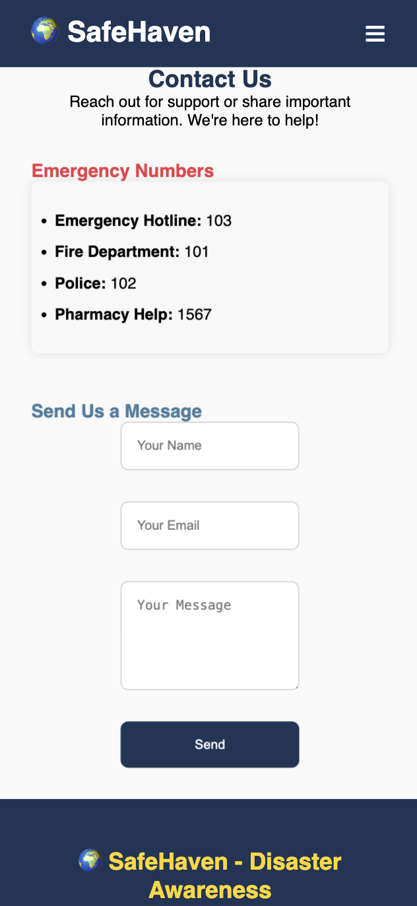

# 🌍 SafeHaven - Disaster Relief Web Application

SafeHaven, doğal afetlere hazırlık, güvenli sığınak bulma ve hava durumu takibi gibi önemli özellikleri bir araya getiren kullanıcı dostu ve mobil uyumlu bir web uygulamasıdır.

## 🚀 Özellikler
✅ Avrupa ve Türkiye'deki güvenli sığınaklar harita üzerinde gösterilir  
✅ Open-Meteo hava durumu API entegrasyonu  
✅ Dinamik ülke ve şehir seçimiyle hava durumu takibi  
✅ Modern, responsive ve animasyonlu tasarım  
✅ Formspree entegrasyonlu iletişim formu  
✅ Node.js Express backend ile API desteği

---

## 🖼️ **Proje Görselleri**

### 🌐 Ana Sayfa


### 🗺️ Harita ve Sığınaklar


### 🌦️ Hava Durumu Modülü


### 📩 İletişim Formu


---

## 🗺️ Kullanılan Teknolojiler
- React.js
- React Router DOM
- React Leaflet (OpenStreetMap)
- Open-Meteo API
- HTML / CSS Animasyon
- Formspree
- Node.js + Express.js
- Axios

---

## 📂 Kurulum
```bash
git clone https://github.com/barisyonel/SafeHaven-Disaster-Relief-App.git
cd SafeHaven-Disaster-Relief-App
npm install
npm run dev
